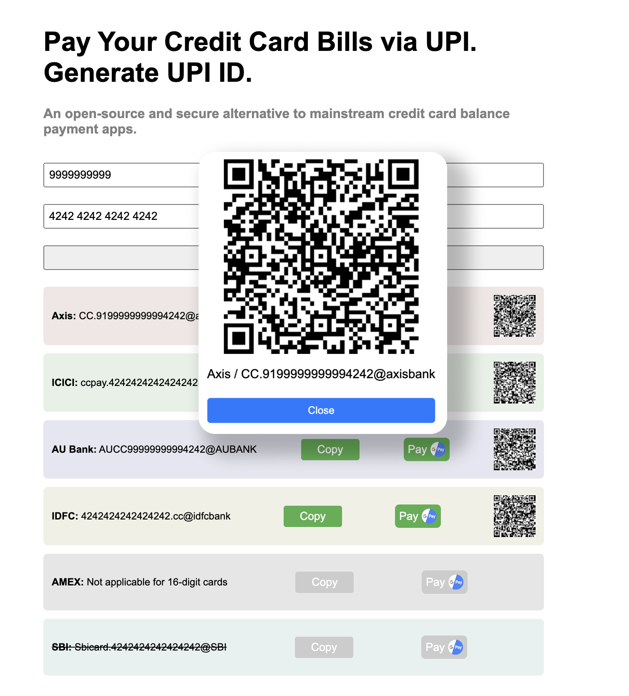

# UPI ID Generator for Credit Card Bills

## Access the Live Tool
It is hosted on GitHub Pages [here](https://redeemapp.github.io/cc-billpay-upi-id/).

## Overview
Did you know you can pay credit card bills via UPI id?

Yes, almost all the banks have provided a way to do that. 

## Features
You can use the tool to take a quick look at the format.

OR 

You can use the tool to generate the upi id.

## Security

* No data including cc number leaves your system.
* Source code is publicly available on GitHub.

## Demo

## Installation

## Usage

* Just enter your mobile number (auto-complete is enabled)

* Enter the card number (auto-complete is enabled)

## Contribution

Before starting to contribute to this project, kindly follow the steps below:

1. First begin by creating an issue describing the feature or bug fix you wish to work on.
2. Ensure you get the created issue assigned to yourself before proceeding with the changes.
3. Start working on the issue by first checking the source folder (`src/`), the components directory (`src/components/`) and the main application file (`App.tsx`).
4. After completing the updates, please test the changes locally on your machine.
5. Once you are satisfied with your changes and all tests pass, submit a pull request with all the updated files except the `docs/` folder. Commits to the `docs/` directory, which contains the final compiled code, will be handled by the admins for now.

Please familiarize yourself with the upi id formats for various banks if you are contributing to that aspect:
- [American Express (Amex)](https://www.americanexpress.com/in/customer-service/payments-statements-and-balance/making-a-payment.html)
- [ICICI Bank](https://www.icicibank.com/blogs/credit-card/credit-card-payment-procedure)
- [Axis Bank](https://www.axisbank.com/progress-with-us/digital-banking/how-to-pay-your-loan-emi-and-credit-card-dues-using-upi)
- [IDFC Bank](https://www.idfcfirstbank.com/finfirst-blogs/credit-card/ways-to-make-credit-card-bill-payment)
- [AU Bank](https://www.aubank.in/commercial-credit-cards-bill-payment)

## License

This project is under the MIT License

## Conclusion
Enjoy simpler payment methods with our UPI ID generator for credit card bills.
