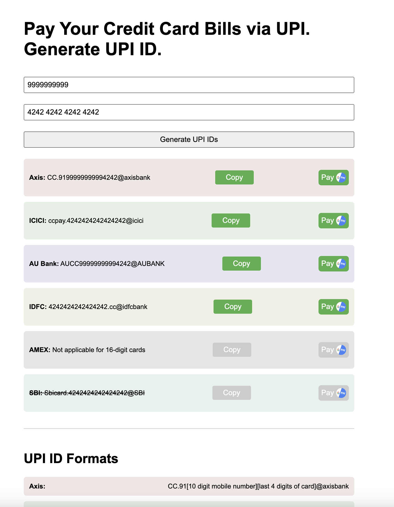

# UPI ID Generator for Credit Card Bills

## Access the Live Tool
It is hosted on GitHub Pages [here](https://redeemapp.github.io/cc-billpay-upi-id/).

## Overview
Did you know you can pay credit card bills via UPI id?

Yes, almost all the banks have provided a way to do that. 

## Features
You can use the tool to take a quick look at the format.

OR 

You can use the tool to generate the upi id.

## Security

* No data including cc number leaves your system.
* Source code is publicly available on GitHub.

## Demo

## Installation

## Usage

* Just enter your mobile number (auto-complete is enabled)

* Enter the card number (auto-complete is enabled)

## Contribution

Data compiled from various sources / blogs.

## License

This project is under the MIT License

## Conclusion
Enjoy simpler payment methods with our UPI ID generator for credit card bills.
